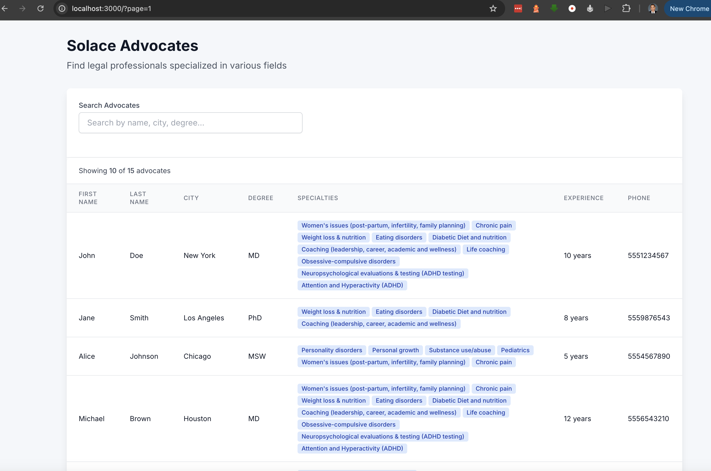

1. Table elements were repaired and corrected, addressing inaccurate or malformed table tags to ensure proper rendering and accessibility.
2. Missing keys were systematically added to list-rendered components, resolving React warnings and improving rendering performance.
3. Pagination functionality was introduced to the table, enabling efficient navigation through large datasets.
4. Filtering logic was migrated from the frontend to the database layer, resulting in more efficient data retrieval and reduced client-side processing.
5. Minimal styling enhancements were applied to improve the visual presentation and user experience.
6. The Docker Compose configuration was updated to include a Dockerfile, streamlining the startup process. Running `docker compose up -d` now launches both the Next.js application and the PostgreSQL database seamlessly.
7. Migration and configuration scripts were refined for improved reliability and maintainability.
8. A simple `useDebounce` hook was implemented to optimize backend request frequency, particularly during user input.
9. The phone number field was changed from a numeric type to a string, and a corresponding migration was generated, addressing a comment observed in the codebase.
